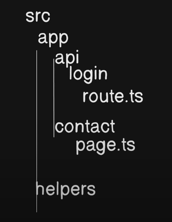
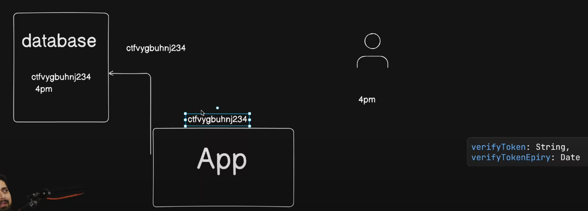

## References

- NEXT JS project structure
  

- Verify token and password token working rough diagram
  

## Project Setup

```bash
npx create-next-app@latest
```

## Package Installation

```bash
- To install mongoDB:
  npm i mongoose

- To send mail, we will use nodemailer:
  npm install nodemailer


```
